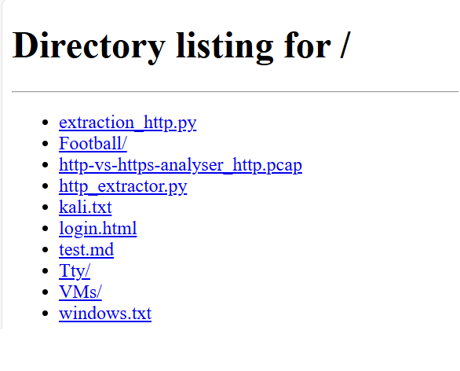
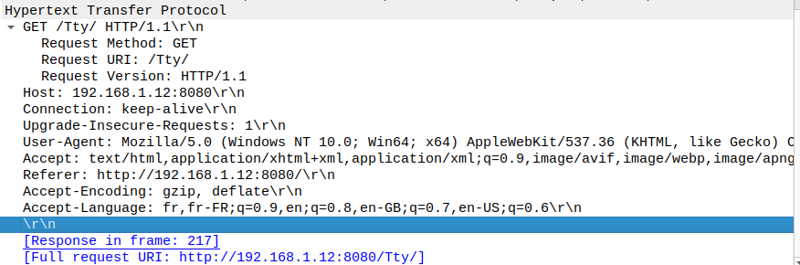
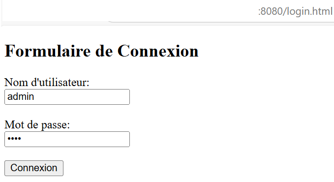
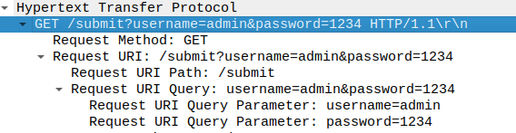
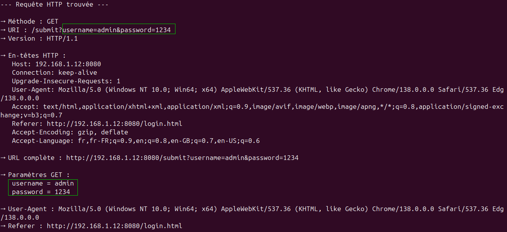
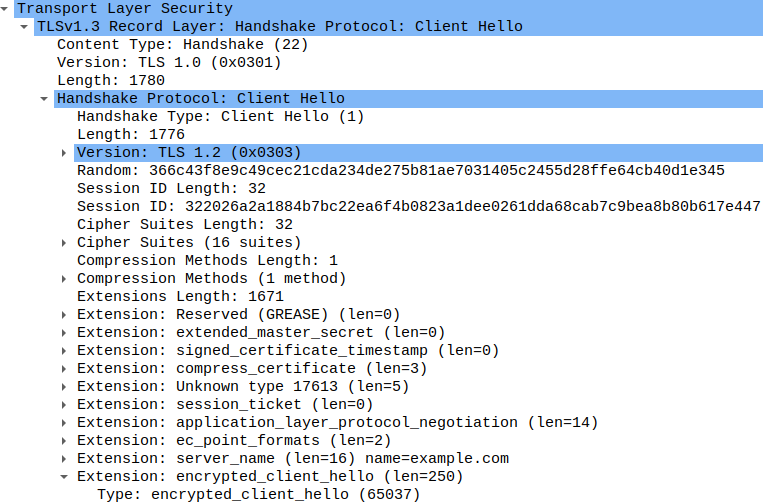
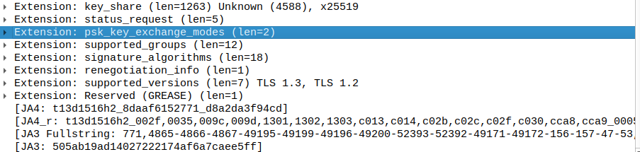

**Note** : Toutes les données affichées ici sont issues d’un laboratoire personnel (BamLab). Les identifiants sont fictifs et utilisés uniquement à des fins pédagogiques.


## **Introduction**

Comprendre le trafic réseau est un prérequis fondamental pour quiconque s’intéresse à la cybersécurité. Trop souvent, les notions de protocole, d'interception ou d’analyse semblent abstraites. Ce projet propose une immersion concrète et accessible pour observer, analyser, et surtout **comprendre** ce qui transite réellement entre deux machines.

À travers une approche simple et reproductible, j’ai créé un environnement local dans lequel j’ai généré du trafic HTTP et HTTPS pour mieux saisir leurs différences, et les risques que cela implique.


## **Objectifs du projet**

- Mettre en place un environnement de test local (type LAN ou VMs)
- Générer et observer du trafic HTTP et HTTPS
- Capturer et analyser les échanges via Wireshark
- Extraire les données clés d’une requête HTTP (URL, paramètres, cookies…) via Python (Scapy)
- Comparer la visibilité des données entre HTTP et HTTPS


## **Méthodologie**

### **1. Environnement de test**

J'ai utilisé deux machines physiques (Windows et Ubuntu) connectées au **même réseau local**. L'une jouait le rôle de serveur, l'autre de client.

#### **Configuration du serveur HTTP :** 

```bash
python3 -m http.server 8080
```

Cette commande partage les fichiers du dossier courant sur le port 8080. Le serveur devient alors accessible depuis les autres machines du réseau.

#### Déterminer l’adresse IP du serveur :

```bash
ip a #ou ifconfig (Ubuntu)
```

Exemple d’adresse obtenue :  

```
192.168.6.24
```

#### **Depuis la machine cliente :**

- Accès via navigateur : http://192.168.6.24:8080
- Ou en ligne de commande : curl http://192.168.6.24:8080

Voici le résultat :  


Cela montre la réussite de la connexion réseau entre client et serveur et on accède à l’arborescence des fichiers du dossier courant partagé par la machine serveur.


### 2. Surveillance avec Wireshark

#### Filtrage des paquets :

- Pour HTTP :

```wireshark
http
```

- Pour HTTPS (TLS) :

```wireshark
tls
```

ou plus large :

```wireshark
tcp.port == 443
```

#### 2.1 Observation du trafic HTTP

**Étape réalisée** : Lancement de Wireshark sur le serveur, puis navigation depuis le client vers le dossier `Tty`.

Depuis le navigateur client, j'accède à l'URL suivante : http://192.168.1.24:8080/Tty/

**Résultat** : Des dizaines de paquets HTTP sont capturés par Wireshark.


**Commentaire** : On observe une série de requêtes GET vers le serveur, avec une réponse 200 OK pour chacune.



**Commentaire** : Les en-têtes HTTP sont visibles en clair (Host, User-Agent, Accept…). Si cette requête contenait un mot de passe ou des paramètres sensibles, ils seraient lisibles ici !

> ⚠️ Cette étape illustre de manière flagrante le manque de confidentialité du protocole HTTP.


##### Un paquet HTTP capturé : Analyse détaillée

###### a. En-tête IP (niveau 3 - réseau) 

| Champ             | Valeur       |
| ----------------- | ------------ |
| Internet Protocol | Version 4    |
| Source            | 192.168.1.13 |
| Destination       | 192.1628.1.1 |

**Qui parle à qui ?**

- L'appareil 192.168.1.13 (le **client**) envoie une requête à 192.168.1.12 (le **serveur HTTP**).

  

###### b. En-tête TCP (niveau 4 - transport)

| Champ            | Valeur |
| ---------------- | ------ |
| Source Port      | 51887  |
| Destination Port | 8080   |
| Sequence         | 1      |
| Acknowledgment   | 1      |
| Length           | 519    |

 **TCP = canal de communication fiable**

- Le client utilise un **port source aléatoire** (ici 51887).

- Il communique avec le port **8080** du serveur (où http.server écoute).

- Len: 519 → La taille des données applicatives.

  

###### c. En-tête HTTP (niveau 7 - application)

GET /Tty/ HTTP/1.1

**Détails de la requête** : 

| **Élément**  | **Signification**                       |
| ------------ | --------------------------------------- |
| **GET**      | Méthode HTTP (lecture)                  |
| **/Tty/**    | URI demandé (chemin vers une ressource) |
| **HTTP/1.1** | Version du protocole                    |


###### d. Autres champs HTTP (Headers)

| **En-tête**                          | **Description**                                   |
| ------------------------------------ | ------------------------------------------------- |
| Host: 192.168.1.12:8080              | Obligatoire en HTTP/1.1, indique le serveur ciblé |
| Connection: keep-alive               | Garder la connexion TCP ouverte après la réponse  |
| Upgrade-Insecure-Requests: 1         | Demande HTTPS si possible                         |
| User-Agent: Mozilla/...              | Le navigateur du client                           |
| Accept: ...                          | Formats de contenu acceptés                       |
| Referer: http://192.168.1.12:8080/Ar | La page précédente                                |
| Accept-Encoding: gzip, deflate       | Compression acceptée                              |
| Accept-Language: fr, en              | Langues préférées                                 |


###### e. Infos additionnelles de Wireshark

- [Response in frame: 217] → La **réponse du serveur** se trouve dans la **trame n°217**
- Full request URI: http://192.168.1.12:8080/Tty/ → URI complet, utile pour les logs ou analyses

*Nota : **URI (Uniform Resource Identifier)** = identifiant unique qui désigne une ressource sur un réseau, comme une URL (ex: `http://example.com/index.html`).*


#### 2.2. Visualisation d’un mot de passe transmis en clair via `login.html`

Pour simuler un scénario réaliste d'interception de credentials, j’ai commencé par créer un **formulaire de connexion simple** appelé `login.html`. Ce formulaire contient deux champs classiques : **nom d'utilisateur** et **mot de passe**.

**Étapes réalisées :**

1. J’ai placé ce fichier HTML dans un **répertoire partagé par le serveur HTTP**.
2. Depuis la machine cliente, je me suis connecté à ce serveur et j’ai ouvert `login.html` via un navigateur.
3. J’ai saisi des identifiants fictifs (ex. `username=admin`, `password=1234`) et j’ai validé le formulaire.



> Simulation d'une authentification classique sur une page HTTP non sécurisée.

Cette action génère une **requête HTTP POST** contenant les identifiants **en clair**, que l’on peut facilement intercepter. Et en voilà la preuve via la capture suivante : 



***NB** : Un simple formulaire sur HTTP peut exposer des identifiants sensibles. D’où l’importance de toujours utiliser **HTTPS** pour les communications contenant des données confidentielles.*


#### 2.3 Scénario réel - Automatisation : interception d’identifiants via login.html 

Lorsque l’on parle de cybersécurité, on pense souvent à des attaques sophistiquées… mais parfois, les failles viennent simplement d’un mot de passe qui transite **en clair** sur le réseau. **J'automatise l’analyse du trafic HTTP** afin d’en extraire les informations les plus critiques et sensibles — **y compris les identifiants !**

**Objectifs du script : **

- Capturer une requête HTTP depuis un fichier `.pcap` 
- Extraire automatiquement tous les éléments d'une requête HTTP :
  - Méthode (GET/POST)
  - URL complète
  - Paramètres GET et POST
  - En-têtes HTTP (tous, y compris les rares)
  - Cookies
  - User-Agent, Referer, Content-Type, etc.
  - Authentification
  - Corps brut de la requête POST
- Repérer et **mettre en évidence les paramètres sensibles** (`username`, `password`, `email`, etc.)

> L’objectif est d’offrir une **vue complète et lisible** de chaque requête HTTP interceptée.

**Code source** :  Disponible dans le fichier extract_http_info.py dans le repertoire de ce projet sur github

Voici le resultat d'execution du script pour l'un des paquets capturés : 



> Ce paquet montre clairement que les **identifiants de connexion (`username=admin&password=1234`) sont transmis en clair** via une requête GET. Cela signifie que **toute personne en mesure d'intercepter ce trafic réseau peut lire directement les informations sensibles**, comme les mots de passe.
> Cet exemple illustre parfaitement les risques de sécurité liés à l'utilisation du protocole HTTP non chiffré, et souligne **l'importance cruciale d'utiliser HTTPS** pour protéger les données des utilisateurs.


## Note

- C’est **du HTTP clair** → tu peux **tout lire en Wireshark**, car **pas chiffré**.
- Tu vois **la requête complète** : IP source, port, headers HTTP, etc.


#### 2.2 Trafic HTTPS (TLS)

Même exercice, cette fois en accédant à un site HTTPS comme `https://www.google.com`.
Bien que le trafic soit visible dans Wireshark via le filtre `tls`, **aucune donnée n’est lisible** sans la clé privée du serveur.



Une requête HTTPS illisible. Démonstration visuelle de la puissance du chiffrement TLS.



------

## Résultats obtenus

| Protocole | Visibilité du contenu                                        | Sécurité des identifiants |
| --------- | ------------------------------------------------------------ | ------------------------- |
| HTTP      | Contenu entièrement visible (URL, paramètres, mots de passe) | Aucune sécurité           |
| HTTPS     | Contenu totalement chiffré                                   | Sécurisé par défaut       |

------


## Takeaways

- Le trafic HTTP est une **porte ouverte** aux attaques d’interception.
- HTTPS **protège les utilisateurs** même sur un réseau non sécurisé.
- Il est crucial de **savoir observer** le trafic pour en comprendre les enjeux.

------

## Extensions possibles

- Intercepter du trafic avec un proxy (ex : Burp Suite)
- Étudier les vulnérabilités des sites qui ne forcent pas HTTPS
- Analyser les échanges sur des ports non conventionnels
  
  

------

## Conclusion

Ce projet permet de visualiser très concrètement **à quel point les protocoles influencent la sécurité des données**. Un simple mot de passe en HTTP est visible à quiconque écoute sur le réseau. Avec HTTPS, cette attaque devient impossible sans clé privée ou attaque active.

------

## Liens utiles

- [Script Python complet avec Scapy](./extract_http_info.py)
- [Documentation Scapy](https://scapy.readthedocs.io/en/latest/)
- [Wireshark Filters](https://wiki.wireshark.org/DisplayFilters)
- [Guide : créer un serveur HTTP en Python](https://docs.python.org/3/library/http.server.html)

------

## Envie d'en discuter ?

Je publie ce projet pour inspirer, apprendre, échanger.
Tu peux le tester, le forker, ou me contacter pour toute question.
Sur LinkedIn, je partagerai quelques réflexions sur ce que ce type d’expérimentation apporte à notre compréhension de la cybersécurité.

